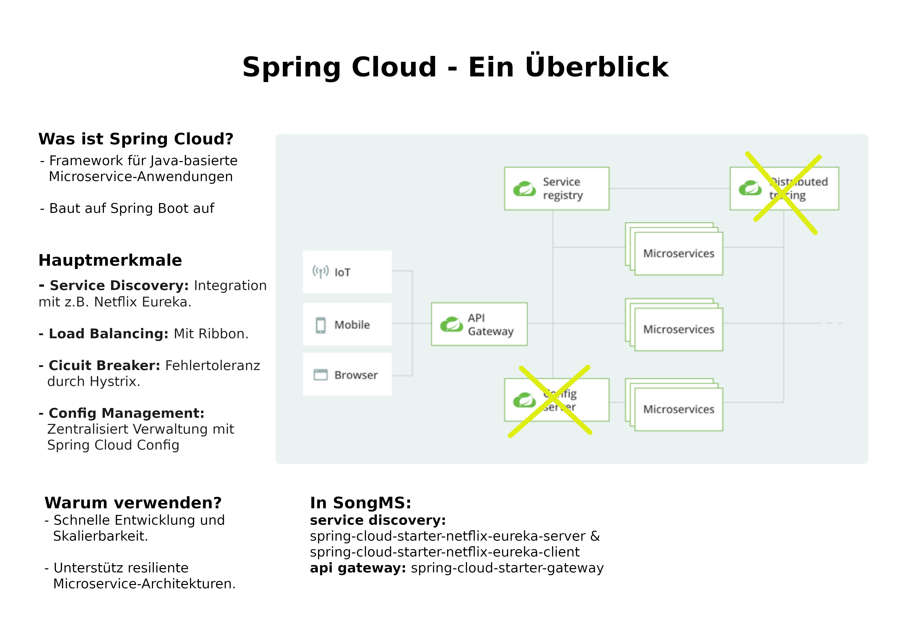
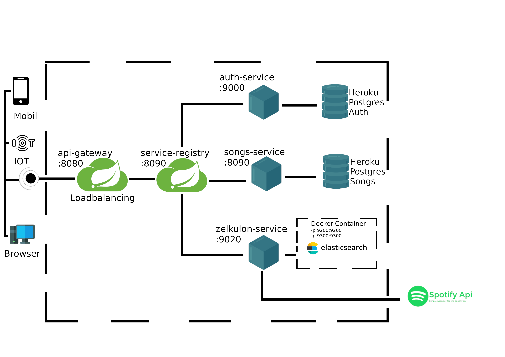
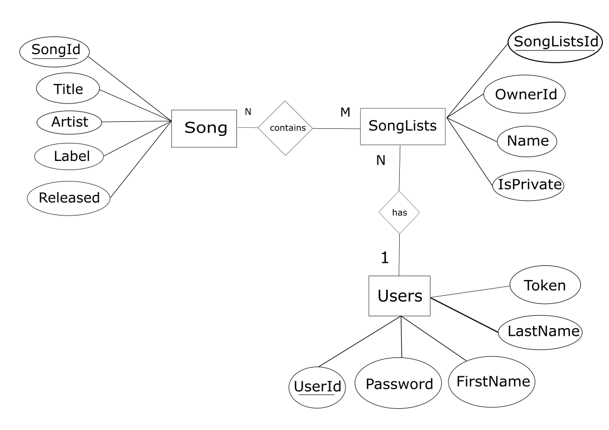
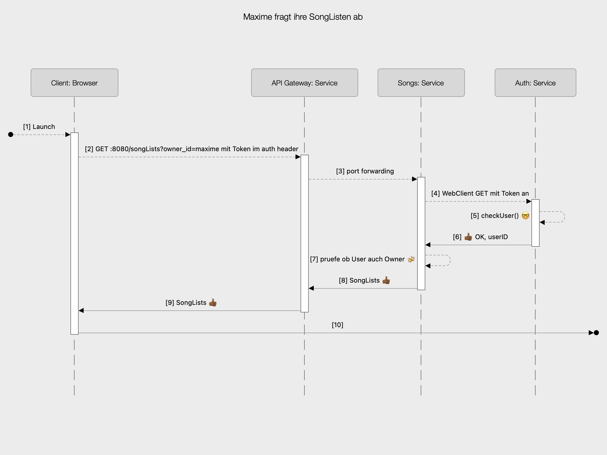
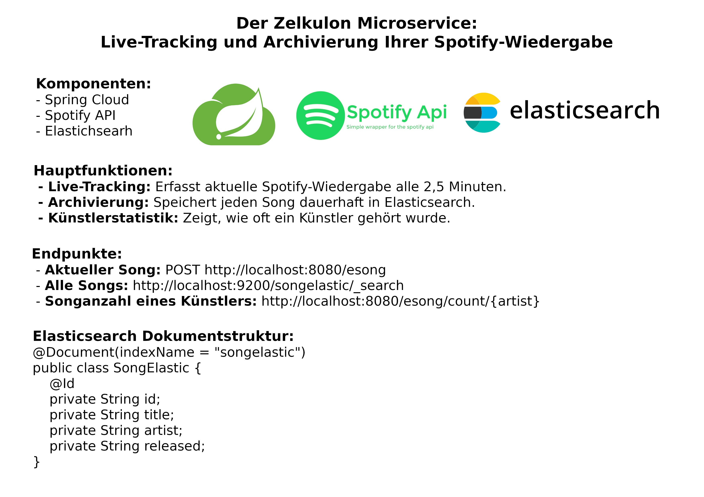

# SongsMS

## Gliederung

1.  [Einleitung](#Einleitung)

2. [Spring Cloud - Ein Überblick](#spring-cloud---ein-überblick)

3.  [Software Architektur Diagramm](#software-architektur-diagramm)
 - [ER-Modell](#er-modell)
 - [Schema der SongsMS Datenbank](#schema-der-songsms-datenbank)
 - [Sequenz-Diagramm](#sequenz-diagramm)

4. [Zeulkulon Microservice](#zelkulon-microservice)

5. [Quellen](#quellen)

# Einleitung
* Diese Projekt besteht aus drei Services
    1. auth-service mit dem Endpunkt /auth PORT:9000
    2. song-service mit den Endpunkten /songs & /songLists PORT:9010
    3. zelkulon-service mit dem Endpunkt /esong PORT:9020
* Discovery/Registry Service -> Eureka PORT:8090
* API-Gateway PORT:8080

## Spring Cloud - Ein Überblick

## Software Architektur Diagramm

## ER Modell

## Schema der SongsMS Datenbank
### Entitäten und Relationen

#### Entitäten:
*song*: {[**song_id:integer**, title:string, artist:string, label:string, released:integer]}

*song_list*: {[**song_lists_id:integer**, owner_id:string, name:string, is_private:boolean]}

*user_account*: {[**user_id:string**, password:string, first_name:string, last_name:string, token:string]}
#### Relationen:
*contains*: {[**SongListId:integer, SongId:integer**]}

## Sequenz Diagramm

## Zelkulon Microservice

## Quellen

https://spotify-web-api-java.github.io/spotify-web-api-java/se/michaelthelin/spotify/requests/AbstractRequest.html

https://www.elastic.co/de/elasticsearch
