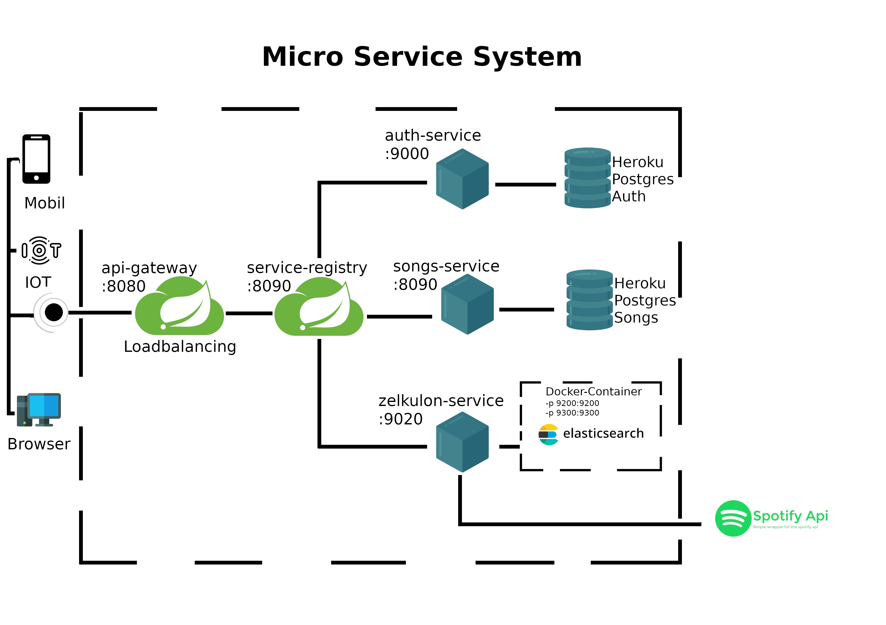

# SongsMS

## Gliederung

1.  [Einleitung](#Einleitung)

2. [Spring Cloud - Ein Überblick](#spring-cloud---ein-überblick)

3.  [Software Architektur Diagramm](#software-architektur-diagramm)
 - [ER-Modell](#er-modell)
 - [Schema der SongsMS Datenbank](#schema-der-songsms-datenbank)
 - [Sequenz-Diagramm](#sequenz-diagramm)

4. [Zeulkulon Microservice](#zelkulon-microservice)

5. [Quellen](#quellen)

# Einleitung
* Diese Projekt besteht aus drei Services
    1. auth-service mit dem Endpunkt /auth PORT:9000
    2. song-service mit den Endpunkten /songs & /songLists PORT:9010
    3. zelkulon-service mit dem Endpunkt /esong PORT:9020
* Discovery/Registry Service -> Eureka PORT:8090
* API-Gateway PORT:8080

## Spring Cloud - Ein Überblick

## Software Architektur Diagramm

## ER Modell

## Schema der SongsMS Datenbank
### Entitäten und Relationen

#### Entitäten:
*song*: {[**song_id:integer**, title:string, artist:string, label:string, released:integer]}

*song_list*: {[**song_lists_id:integer**, owner_id:string, name:string, is_private:boolean]}

*user_account*: {[**user_id:string**, password:string, first_name:string, last_name:string, token:string]}
#### Relationen:
*contains*: {[**SongListId:integer, SongId:integer**]}

## Sequenz Diagramm

## Zelkulon Microservice

## Quellen

https://spotify-web-api-java.github.io/spotify-web-api-java/se/michaelthelin/spotify/requests/AbstractRequest.html

https://www.elastic.co/de/elasticsearch
Bild: ectorised by Vulphere from https://www.elastic.co/products/elasticsearch

gateway
https://www.youtube.com/watch?v=KeZhT5pLn4c

spring-cloud
https://spring.io/cloud

Bild: https://www.e4developer.com/2018/01/22/spring-cloud-blueprint-for-successful-microservices/

bILDER:
<a href="https://www.flaticon.com/free-icons/phone" title="phone icons">Phone icons created by Freepik - Flaticon</a>

<a href="https://www.flaticon.com/free-icons/computer" title="computer icons">Computer icons created by Freepik - Flaticon</a>

<a href="https://www.flaticon.com/free-icons/iot" title="iot icons">Iot icons created by Freepik - Flaticon</a>

<a href="https://www.clipartmax.com/middle/m2i8b1Z5m2N4b1d3_cloud-gateway-spring-cloud-contract-logo/" target="_blank">Cloud Gateway - Spring Cloud Contract Logo @clipartmax.com</a>PoNYnvBjjl72DFo3vtf7/WwYgnRzaiR0Xv7cAdrKwiyqpkFcQz30i7rjmbEii0Kayj83PzbXm4gI1mrYQBacMazHha09SGJT2BUU/3AxLFiATvsVlsbzu7YgoGzgNZaTRcmigaaBkY19+nwE4UfzYKs628UO2txGXFKcnMNmLS2jOTSVJXZshWtj1CDfeN648a3KqD7ZtvGBYngVr38yK35jmMha07/M6eVbun9e0NGKmuvJ17vkZcba4IfOrXZt7E3p7VyBAwtjV50S2AwSwtYGuJHHCs6wfenTi36EVHPnmkMgasoFCkFwNjGho6Ub/RCL6fgoAg9BG+Lto9fCvxZxwRJwHdnXVkO1bGadfSToNOAGfGW1tKLMFnqpuknF4/AcS35U8YRpesXyc8EmEG0W64s6AWrjcEqdAGVgVwVUQCwyCbzNouJhZIlH8PJ4bS/OUSEh1EU3X1HhRnj3+9s3dPB/0tLl4rhaHWdLk/3x95dX15x/eMhmPSGDXD7H6I+843/kuBPAAAAAElFTkSuQmCC

<a href="https://www.flaticon.com/free-icons/module" title="module icons">Module icons created by juicy_fish - Flaticon</a>

<a href="https://www.flaticon.com/free-icons/database" title="database icons">Database icons created by juicy_fish - Flaticon</a>

