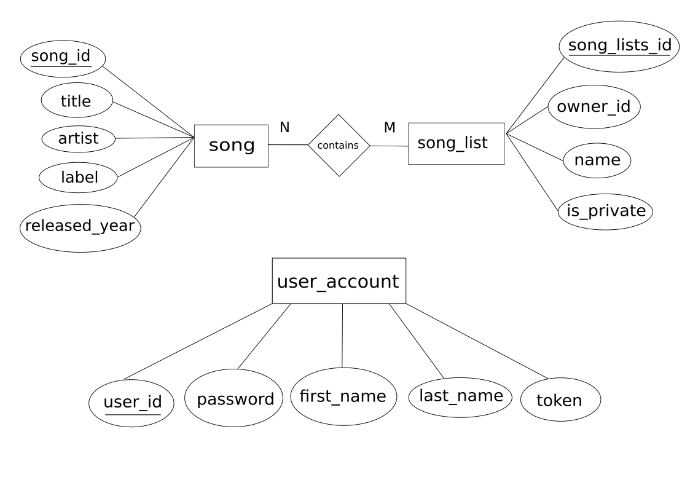

https://spotify-web-api-java.github.io/spotify-web-api-java/se/michaelthelin/spotify/requests/AbstractRequest.html

# Einleitung
* Diese Projekt besteht aus drei Services
    1. /auth PORT:9000
    2. /songs & /songLists PORT:9010
    3. /textanalyser PORT:9020
* Discovery/Registry Service -> Eureka PORT:8090
* API-Gateway PORT:8080

Service Diagramm

ER Modell

Schema der SongsMS Datenbank

Song: {[SongId:integer, Title:string, Artist:string, Label:string, Released:integer]}
SongList: {[SongListId:integer, OwnerId:string, Name:string, IsPrivate]}
User: {[UserId:string, Password:string, FirstName:string, LastName:string, Token:string]}

enthält: {[SongListId:integer, SongId:integer]}
hat: {[UserId:string, SongListId:integer]}

# Gliederung

## Service Discover/Registry Client and Server Registry

## APIGateway

## Zelkulon Service as a Service [#ZelSaaS(#ZelSaaS)]

## Ausblick

